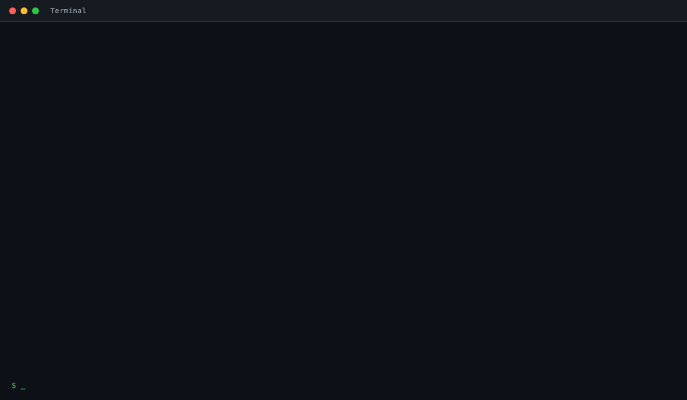

# Quin Agent Scanner

> Nothing in your codebase is hidden from Quin.

[](LICENSE)
[](https://www.python.org/downloads/)

Named after [Bao Qingtian](https://gaincontrol.ai/about) -- the incorruptible judge of the Song Dynasty who saw through every deception -- **Quin** is an open-source CLI tool by [Gaincontrol](https://gaincontrol.ai/) that scans any codebase to detect AI agents, extract system prompts, classify risk, and produce compliance-ready reports.

Point Quin at a repo and get back: every AI agent, what it does, what tools it has, and what risks it carries -- in a single HTML report.

Learn more at [gaincontrol.ai/quin](https://gaincontrol.ai/quin).

> **Note:** This is version **0.1.0b2** -- an early public release under active development. Scan results are provided **as-is** and may be incomplete, inaccurate, or contain false positives/negatives. **Always review and validate findings independently before making security, compliance, or architectural decisions based on them.** The authors and contributors of Quin accept no responsibility or liability for any actions taken, or not taken, based on the output of this tool. If you encounter any issues, please [open an issue](https://github.com/Gaincontrol-Pte-Ltd/quin-agent-scanner/issues) or email us at [pixiedust@gaincontrol.ai](mailto:pixiedust@gaincontrol.ai) -- your feedback helps us improve the scanner.

---

## About Gaincontrol

Quin is built by [Gaincontrol](https://gaincontrol.ai/), headquartered in Singapore. We build the infrastructure enterprises need to run AI agents safely.

| Product | What it does |
|---|---|
| **[Quin](https://gaincontrol.ai/quin)** | AI Agent Scanner -- see every agent, trust nothing blindly |
| **[Aegis](https://gaincontrol.ai/)** | AI Identity Governance -- every agent operates only within its granted authority |
| **[Drona](https://gaincontrol.ai/)** | Safe Execution Fabric -- deterministic execution for probabilistic AI |

- **Website:** [gaincontrol.ai](https://gaincontrol.ai/)
- **Contact:** [pixiedust@gaincontrol.ai](mailto:pixiedust@gaincontrol.ai)

---

## Quick Start

### 1. Install

```bash
pip install quin-scanner
```

Or with [uv](https://docs.astral.sh/uv/):

```bash
uv tool install quin-scanner
```

### 2. Set up your `.env`

Create a `.env` file in your working directory:

```bash
# Pick one LLM provider:
ANTHROPIC_API_KEY=sk-ant-...
# OPENAI_API_KEY=sk-...
# GOOGLE_API_KEY=...

# For scanning GitHub repos or orgs:
GITHUB_TOKEN=ghp_...

# Optional — vulnerability web search (OSV.dev is always on).
# Reuses the chosen provider's API key; set PERPLEXITY_API_KEY if you pick perplexity.
# VULN_SEARCH_PROVIDER=anthropic       # perplexity | gemini | openai | anthropic | none
# PERPLEXITY_API_KEY=pplx-...

# Optional — custom base URL for OpenAI-compatible endpoints (vLLM, LiteLLM, Azure, Ollama).
# OPENAI_COMPATIBLE_URL=http://localhost:11434/v1
```

### 3. Set up `scanner-config.yaml`

```bash
curl -O https://raw.githubusercontent.com/Gaincontrol-Pte-Ltd/quin-agent-scanner/main/scanner-config.yaml
```

The default config uses Anthropic and outputs HTML:

```yaml
llm:
  provider: anthropic                  # openai | anthropic | google | ollama | openai-compatible
  model: claude-haiku-4-5-20251001
  # api_key_env: ANTHROPIC_API_KEY     # reads from your .env

output:
  format: html                         # html | json | yaml

vuln_check:
  enabled: true                        # OSV.dev lookup for detected framework+version
  search_provider: anthropic           # perplexity | gemini | openai | anthropic | none
  # search_model: sonar-pro            # optional override; provider defaults otherwise
  osv_timeout_seconds: 30
  web_timeout_seconds: 60

scanners:
  enabled:
    - dependency
    - config
    - code_pattern
    - file_structure
    - framework
    - prompt_discovery
    - dockerfile
    - jupyter
    - iac
    - ci
    - mcp
    - agent_instance
    - tool_definition
```

### 4. Run your first scan

```bash
# Scan a local repo -- generates an HTML report in ./report/
quin-scanner scan ./path/to/repo --config scanner-config.yaml

# Scan a GitHub repo
quin-scanner scan https://github.com/org/repo --config scanner-config.yaml

# Static-only scan (no LLM, no API key needed)
quin-scanner scan ./path/to/repo --config scanner-config.yaml --no-llm

# Skip the vulnerability lookup, or pick a different web-search provider
quin-scanner scan ./path/to/repo --config scanner-config.yaml --no-vuln-check
quin-scanner scan ./path/to/repo --config scanner-config.yaml --vuln-search-provider perplexity
```

---

## GitHub Action

Add Quin to your CI to scan every push and surface findings as PR annotations via GitHub code scanning:

```yaml
name: Quin Scan

on:
  push:
    branches: [main]
  pull_request:

permissions:
  security-events: write
  contents: read

jobs:
  scan:
    runs-on: ubuntu-latest
    steps:
      - uses: actions/checkout@v4
      - uses: Gaincontrol-Pte-Ltd/quin-agent-scanner@v1
```

By default this runs in `--no-llm` mode — static findings plus CVE vulnerability checks (via OSV.dev), no API key required. For richer agent/risk analysis, pass an LLM API key:

```yaml
      - uses: Gaincontrol-Pte-Ltd/quin-agent-scanner@v1
        with:
          llm-provider: anthropic
          llm-api-key: ${{ secrets.ANTHROPIC_API_KEY }}
```

**Inputs:**

| Name | Default | Description |
|---|---|---|
| `llm-provider` | `''` | LLM provider (`openai`\|`anthropic`\|`google`\|`ollama`\|`openai-compatible`). Only used when `llm-api-key` is set. |
| `llm-api-key` | `''` | API key for the chosen provider. Setting this enables LLM analysis; leaving it empty runs `--no-llm`. |
| `llm-model` | `''` | Override the default model for the provider. |
| `min-confidence` | `'0.0'` | Exclude artifacts below this confidence threshold (0.0–1.0). |

The workflow's `permissions: security-events: write` is required for the SARIF upload step to succeed — GitHub Actions doesn't grant it by default.

---

## Demo



**Sample Report Walkthrough:**


---

## Scan an Entire GitHub Org

```bash
quin-scanner scan-org my-github-org \
  --config scanner-config.yaml \
  --skip-archived \
  --skip-forks
```

This discovers all repos in the org via the GitHub API, scans each one, and writes per-repo HTML reports to `./report/`.

```
Options:
  -o, --output [json|yaml|html]   Output format (default: html)
  --output-dir PATH               Directory for reports (default: ./report/)
  --skip-archived                 Skip archived repositories
  --skip-forks                    Skip forked repositories
  --no-llm                        Skip LLM analysis
  --config PATH                   Path to scanner-config.yaml
```

Requires `GITHUB_TOKEN` with `repo` + `read:org` scopes. Create one at [github.com/settings/tokens](https://github.com/settings/tokens).

---

## Supported Frameworks

Quin detects AI usage across these frameworks and SDKs:

| Framework | Language |
|---|---|
| LangChain / LangGraph | Python, Node.js |
| CrewAI | Python |
| AutoGen | Python |
| MetaGPT | Python |
| OpenAI Agents SDK | Python |
| Anthropic Agent SDK | Python |
| Google ADK | Python |
| Strands Agents (AWS) | Python |
| Microsoft Agent Framework | Python |
| LangChain Deep Agents | Python, TypeScript |
| Agno (formerly Phidata) | Python |
| Mastra | TypeScript |
| Databricks Agent Framework | Python |
| LlamaIndex | Python, Node.js |
| Haystack | Python |
| Semantic Kernel | Python, Node.js |
| Dify | Python |
| Flowise | Node.js |
| PromptFlow | Python |
| Vercel AI SDK | TypeScript |
| MCP (Model Context Protocol) | Any |
| OpenClaw | Node.js |
| PydanticAI | Python |
| DSPy / Guidance / Outlines | Python |
| OpenAI SDK | Python, Node.js, Go, Rust, Java |
| Anthropic SDK | Python, Node.js |
| Google Generative AI | Python, Node.js |
| Transformers / Diffusers | Python |
| LiteLLM | Python |

Also detects vector databases (ChromaDB, Pinecone, Qdrant, Weaviate, FAISS, pgvector, Milvus), embedding providers (Cohere, Sentence Transformers, Hugging Face), and voice/image AI packages (ElevenLabs, Whisper, Stable Diffusion).

---

## Example Reports

Sample HTML reports for several supported frameworks live in [`examples/reports/`](examples/reports/), each generated by scanning that framework's public example repository -- see the [examples index](examples/README.md) for the full list and links.

> **Disclaimer:** These example reports were generated as-is, by scanning the listed public repositories at a single point in time, purely to demonstrate Quin's capabilities. They are not audits, are not endorsed by the scanned projects' maintainers, and may not reflect those repositories' current state. If you are a maintainer of a scanned repository, or otherwise believe any finding in an example report is inaccurate, please [open an issue](https://github.com/Gaincontrol-Pte-Ltd/quin-agent-scanner/issues) or email [pixiedust@gaincontrol.ai](mailto:pixiedust@gaincontrol.ai).

---

## Installation

### Prerequisites

- **Python 3.11+** -- [download](https://www.python.org/downloads/)
- **An LLM API key** -- OpenAI, Anthropic, Google, or a local Ollama model
- **git** -- for scanning GitHub repos
- **GitHub token** _(optional)_ -- for private repos or org scanning

### From PyPI

```bash
pip install quin-scanner
```

### From source

```bash
git clone https://github.com/Gaincontrol-Pte-Ltd/quin-agent-scanner
cd quin-agent-scanner
curl -LsSf https://astral.sh/uv/install.sh | sh
uv sync --all-extras
cp .env.example .env   # edit with your API keys

uv run quin-scanner scan ./path/to/repo --config scanner-config.yaml
```

### LLM Providers

| Provider | Config value | Default Model | API Key Env Var |
|---|---|---|---|
| Anthropic | `anthropic` | `claude-haiku-4-5-20251001` | `ANTHROPIC_API_KEY` |
| OpenAI | `openai` | `gpt-4o-mini` | `OPENAI_API_KEY` |
| Google | `google` | `gemini-2.0-flash` | `GOOGLE_API_KEY` |
| Ollama (local) | `ollama` | `llama3.2` | -- |
| OpenAI-compatible | `openai-compatible` | _(set with `--llm-model`)_ | `OPENAI_API_KEY` |

---

## How It Works

Quin runs 13 scanner plugins in parallel, looks up known CVEs for the detected framework, then uses a two-pass LLM pipeline:

```
Repo  -->  13 Scanners (parallel)  -->  Vulnerability Lookup  -->  Pass 1: Classification  -->  Pass 2: Synthesis  -->  Report
```

1. **13 scanners** detect dependencies, code patterns, configs, prompts, frameworks, tools, agents, MCP servers, Dockerfiles, notebooks, CI pipelines, and infrastructure-as-code
2. **Vulnerability lookup** -- once the agentic framework and its base version are identified (e.g. `CrewAI 0.80.0`), the scanner queries OSV.dev and optionally an LLM with web search for recent advisories. Critical/high findings are promoted into risk signals
3. **Pass 1 (Classification)** -- an LLM classifies the system type (`standard_ai`, `agentic_ai`, `mcp_enabled`, `multi_agent`) and identifies relevant threats from a taxonomy sourced from OWASP LLM Top 10, OWASP Agentic Top 10, OWASP MCP Top 10, MAESTRO, and Databricks DASF
4. **Pass 2 (Synthesis)** -- a second LLM call profiles each agent with taxonomy-grounded risk indicators, maps tool usages to service categories, and generates a narrative summary

Use `--no-llm` to skip both LLM passes and run scanners only. Use `--no-vuln-check` to skip the vulnerability lookup.

---

## Vulnerability Lookup

When a framework and its base version are detected, Quin checks for known CVEs and promotes critical/high-severity findings into the report's risk signals. All findings are listed under `vulnerabilities` in the report.

| Source | When it runs | Auth |
|---|---|---|
| **OSV.dev** | Always, when `vuln_check.enabled: true` | None |
| **LLM web search** | Optional, when `search_provider` is set | Reuses the chosen provider's API key |

**Supported web-search providers** (each reuses its own existing API key env var):

| Provider | Env var | Default model |
|---|---|---|
| `perplexity` | `PERPLEXITY_API_KEY` | `sonar-pro` |
| `gemini` | `GOOGLE_API_KEY` | `gemini-2.0-flash` |
| `openai` | `OPENAI_API_KEY` | `gpt-4o-mini` |
| `anthropic` | `ANTHROPIC_API_KEY` | `claude-haiku-4-5-20251001` |
| `none` | -- | disables web search (OSV still runs) |

Precedence: `--vuln-search-provider` CLI flag > `VULN_SEARCH_PROVIDER` env var > `vuln_check.search_provider` in YAML.

---

## Contributing

See [CONTRIBUTING.md](CONTRIBUTING.md).

---

## License

Apache-2.0 -- see [LICENSE](LICENSE).
